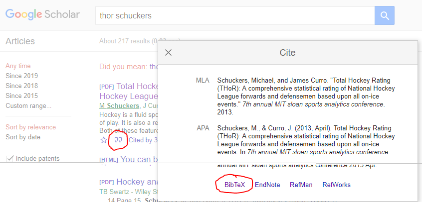

# sportsBibTeX
A BibTeX file, `bibliography.bib`, with sports analytics references to be used in academic journal articles or otherwise.  Contributions from the community are strongly encouraged. 

#### Citation key
For each citation, the citation key has one of the following two forms

- `lastnameYYYYfirstword` or 
- `lastnameYYYYkeyword`

where 

- `lastname` is the last name of the first author, 
- `YYYY` is the 4 digit year of the publication date
- `firstword` is the first word of the title
- `keyword` is a keyword that distinguishes that from other papers by that author

The citation key is the citation name that will be used with `[@citationkey]` in an `.rmd` paper and `\cite{citationkey}` in a `.tex` paper. 

The default citation key from Google Scholar, for example, is `lastnameYYYYfirstword`.  However, whoever contributes the citation may decide to change the default by choosing a `keyword` that is more memorable than `firstword` and use `lastnameYYYYkeyword` instead. For example, the default BibTeX citation key on Google Scholar for [this paper](http://statsportsconsulting.com/main/wp-content/uploads/Schuckers_Curro_MIT_Sloan_THoR.pdf) is `schuckers2013total`, but the person that contributed the citation changed it to `schuckers2013thor` since THOR is the acronym commonly used to refer to that paper and the metric developed within. 

Note that you can get BibTeX citations on Google Scholar by searching for an author or article at https://scholar.google.com/ and clicking the quotation marks and "BibTeX" as shown here:

Citations are listed in alphabetical order by citation key.

